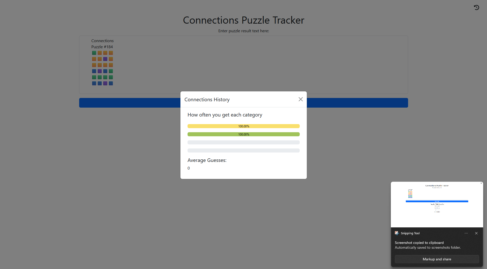

# nyt-connections-tracker

New York Times' Wordle and Mini Crossword have fancy trackers, so why not connections?

Simply hit "Share Your Results", copy, then paste into the form.

It will tell you what categories you got right and add them to a list of all played games. You can check at what percent you get each category (e.g. you get Yellow 87% of the time and Purple 42%)

## Running

### Locally
`python app.py`

### Deploying (to Heroku)
[This tutorial](https://devcenter.heroku.com/articles/getting-started-with-python?singlepage=true#create-and-deploy-the-app)

### Details
- Python Flask web app
- I want to store everything in sessions, but for now localStorage stores the category correct counts used in the calculations
   - Found it easier to update the HTML with JS
- Python functions have full test suite

### Future Goals
- Refactor storage
   - store everything in `session` or `localStorage`
- clean up `requirements.txt`?

### Screenshots

